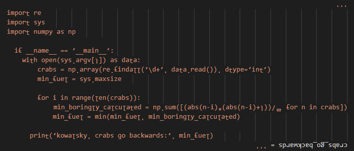

# The Treachery of Whales #

## Featuring... Upside Down! ##

My mom always said that crabs go backwards. They go sideways, but nevermind.

Since I like my mom's version, I turned the code upside down!:

See? if you flip it makes sense and all.

You may thing this is as easy as drawing a penguin but actually is more tricky. Since some valid chars are the inverse of some other valid chars (`p` & `d`, `b` & `q`, etc..) you may end up messing up the code. For this particular case we need to replace everything in one go, and this is given to us by the `translate` functionality.